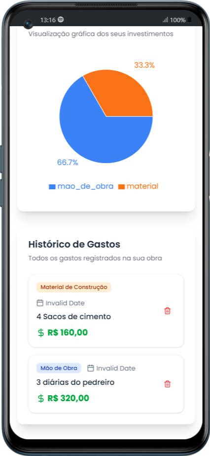

# 🏗️ Controle de Gastos da Obra

Uma aplicação web moderna para gerenciar e controlar os gastos de obras de construção e reforma. Mantenha seus projetos organizados e dentro do orçamento!

## 🌐 Acesse a Aplicação

**🚀 [https://gasto-na-obra.vercel.app/](https://gasto-na-obra.vercel.app/)**

> 💡 **Experimente agora mesmo!** A aplicação está rodando em produção e pode ser instalada como PWA no seu dispositivo.

---


## 📸 Preview da Aplicação

<div align="center">
  
  
</div>

*Interface responsiva otimizada para dispositivos móveis*

## 💡 A História por Trás do Projeto

### Da Necessidade Real ao Aprendizado Contínuo

Este projeto nasceu de uma necessidade real e se transformou em uma jornada de aprendizado e evolução técnica. 

**🏠 O Problema Inicial**
Enquanto reformava minha casa, percebi a dificuldade de manter um controle organizado dos gastos. Eu queria poder registrar cada despesa no momento exato em que ela acontecia, mesmo estando no meio da obra, longe do computador e às vezes sem conexão com a internet.

**📱 A Primeira Ideia: React Native**
Minha solução inicial foi desenvolver um app mobile usando React Native. A ideia fazia todo sentido:
- Mobilidade total para adicionar gastos em qualquer lugar
- Funcionamento offline
- Interface nativa e familiar

**🚧 O Desafio Inesperado**
Quando meu irmão, que também estava passando por uma reforma, viu a proposta e demonstrou interesse em usar a aplicação, surgiu um obstáculo significativo: ele usa iOS. 

Isso criaria várias complicações:
- Necessidade de um Mac para build do app iOS
- Processo burocrático e custoso da App Store
- Manutenção de duas versões diferentes
- Barreiras de distribuição para um projeto pessoal

**💡 A Descoberta: PWA (Progressive Web App)**
Foi então que vi uma oportunidade única de aprendizado. Lembrei-me das PWAs e percebi que essa tecnologia poderia resolver todos os problemas:
- ✅ Funciona em qualquer dispositivo (iOS, Android, Desktop)
- ✅ Instalável como um app nativo
- ✅ Funciona offline
- ✅ Sem App Stores ou custos adicionais
- ✅ Uma única base de código

**🎯 A Jornada de Aprendizado**
Esse projeto se tornou muito mais que uma ferramenta de controle de gastos. Foi uma imersão profunda em tecnologias que eu queria dominar:

- **IndexedDB**: Aprender sobre armazenamento local avançado no navegador
- **Service Workers**: Entender como funciona o cache e funcionalidade offline
- **PWA APIs**: Explorar recursos nativos através de APIs web
- **Arquitetura Moderna**: Aplicar padrões atuais do React com TypeScript
- **UX/UI Responsiva**: Criar uma interface que funciona bem em qualquer dispositivo

**🚀 O Resultado**
O que começou como uma necessidade pessoal se transformou em:
- Uma solução prática e funcional para controle de gastos
- Um projeto de aprendizado que ampliou significativamente meus conhecimentos técnicos
- Uma demonstração prática de como PWAs podem substituir apps nativos em muitos casos
- Uma ferramenta que pode ajudar outras pessoas em situações similares

Esse projeto representa não apenas código, mas uma jornada de resolução de problemas, adaptabilidade e crescimento contínuo como desenvolvedor.

## 📋 Funcionalidades

- ✅ **Cadastro de Gastos**: Adicione despesas com descrição, valor, categoria e data
- 📊 **Dashboard com Estatísticas**: Visualize o resumo dos gastos com gráficos interativos
- 🏷️ **Categorização**: Organize gastos por categorias (Material, Mão de Obra, Ferramentas, etc.)
- 💰 **Controle Total**: Acompanhe gastos por categoria e período
- 🗑️ **Gerenciamento**: Exclua gastos desnecessários
- 📱 **Responsivo**: Interface otimizada para desktop e mobile
- 💾 **Armazenamento Local**: Dados salvos no navegador (IndexedDB)
- 🌐 **PWA Ready**: Funciona offline e pode ser instalado como app

## 🎯 Categorias Disponíveis

- 🧱 Material de Construção
- 👷 Mão de Obra
- 🔧 Ferramentas
- ⚡ Elétrica
- 🚿 Hidráulica
- 🎨 Pintura
- ✨ Acabamento
- 🚛 Transporte
- 🍕 Alimentação
- 📦 Outros

## 🚀 Como executar o projeto

### Pré-requisitos

- Node.js (versão 18 ou superior)
- pnpm (recomendado) ou npm

### Instalação

1. **Clone o repositório**
   ```bash
   git clone https://github.com/kaduh15/gasto-na-obra.git
   cd gasto-na-obra
   ```

2. **Instale as dependências**
   ```bash
   pnpm install
   # ou
   npm install
   ```

3. **Execute o projeto**
   ```bash
   pnpm dev
   # ou
   npm run dev
   ```

4. **Acesse a aplicação**
   Abra [http://localhost:5173](http://localhost:5173) no seu navegador

## 🛠️ Scripts disponíveis

```bash
# Desenvolvimento
pnpm dev

# Build para produção
pnpm build

# Preview da build
pnpm preview

# Linting
pnpm lint
```

## 🏗️ Tecnologias utilizadas

### Core
- **React 19.1.0** - Biblioteca para interface de usuário
- **TypeScript 5.8.3** - Superset do JavaScript com tipagem estática
- **Vite 7.0.4** - Build tool e dev server rápido

### UI/UX
- **Tailwind CSS 4.1.11** - Framework CSS utilitário
- **Radix UI** - Componentes primitivos acessíveis
- **Lucide React** - Ícones modernos
- **Recharts** - Biblioteca de gráficos para React

### Utilitários
- **IndexedDB (idb)** - Banco de dados no navegador
- **Zod** - Validação de schemas TypeScript
- **Class Variance Authority** - Utilitário para classes CSS condicionais

### PWA
- **Vite Plugin PWA** - Geração automática de Service Workers
- **Web App Manifest** - Configuração para instalação como app

## 📁 Estrutura do projeto

```
src/
├── components/           # Componentes React
│   ├── AddExpenseForm/   # Formulário de adição de gastos
│   ├── ui/              # Componentes de interface reutilizáveis
│   ├── ExpenseChart.tsx  # Gráfico de gastos
│   ├── ExpenseList.tsx   # Lista de gastos
│   ├── ExpenseStats.tsx  # Estatísticas dos gastos
│   ├── Header.tsx        # Cabeçalho da aplicação
│   ├── Statistics.tsx    # Cards de estatísticas
│   └── SummaryCard.tsx   # Card de resumo
├── database/            # Funções do banco de dados
│   ├── functions/       # CRUD operations
│   └── index.ts         # Configuração do IndexedDB
├── types/               # Definições de tipos TypeScript
├── utils/               # Funções utilitárias
├── App.tsx             # Componente principal
└── main.tsx            # Ponto de entrada
```

## 💾 Armazenamento de Dados

A aplicação utiliza **IndexedDB** para armazenar os dados localmente no navegador. Isso significa que:

- ✅ Funciona offline
- ✅ Dados persistem entre sessões
- ✅ Não requer servidor
- ⚠️ Dados ficam no navegador específico

## 📝 Licença

Este projeto está sob a licença MIT. Veja o arquivo `LICENSE` para mais detalhes.

---

**Desenvolvido com ❤️ para facilitar o controle de gastos em obras e reformas**

*"Às vezes, os melhores projetos nascem de problemas reais e se transformam em oportunidades de aprendizado."*
